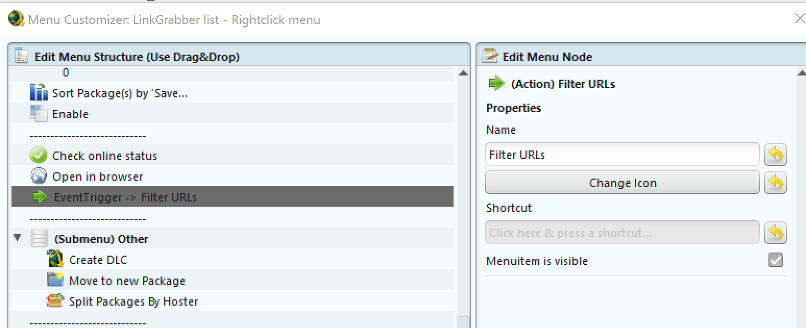

# JDownloader Filter URLs

**Goal**: Filter a list of downloads by comparing the entries to a file (probably created from a fixDat).

---

## JDownloader Setup

1. Enable the 'Event Scripter' plugin (will likely require a restart) ..

   

2. Create a new script in the `Event Scripter` section ..

   * Name: `Filter URLs`
   * Trigger: `Linkgrabber Contextmenu Button Pressed` 

   * 

3. Paste in contents of `filter-urls.js`
   
   You can click `Test Compile` to check you pasted it correctly..
   

4. Click the `Right Click Menu: Linkgrabber table` button and add a new menu item (drag it to where you would like it to appear - you can even change the icon :P)

    It **has** to have the name `Filter URLs` (as it has to match the script lookup)

   

   You should now see it when you `right click` a package in the `Link Grabber` section.

   

