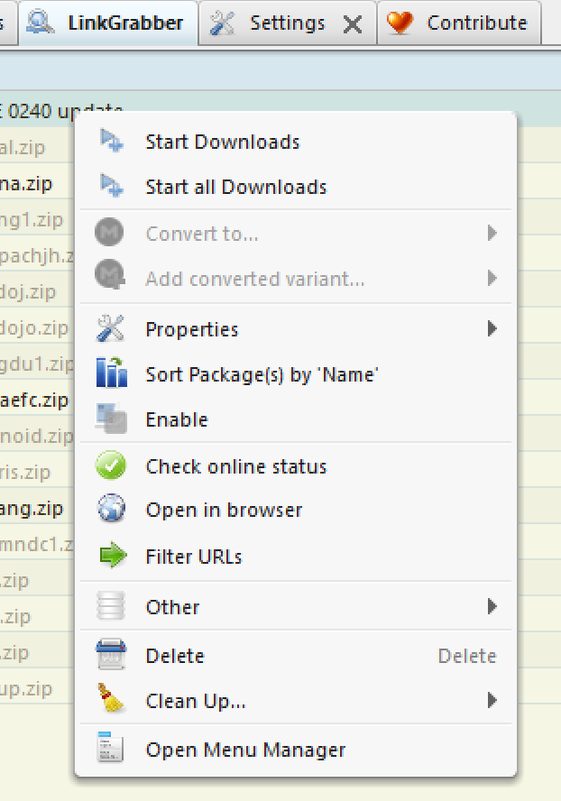

# JDownloader Filter URLs

**Goal**: Filter a list of downloads by comparing the entries to a file (probably created from a fixDat).

It will look at the `filter.json` file and disable any downloads that are **NOT** in the list.

---

## JDownloader Setup

1. Enable the 'Event Scripter' plugin (will likely require a restart) ..

   

2. Create a new script in the `Event Scripter` section ..

   * Name: `Filter URLs`
   * Trigger: `Linkgrabber Contextmenu Button Pressed` 

   * 

3. Paste in contents of `filter-urls.js` (in this directory)

   

   You can click `Test Compile` to check you pasted it correctly..

   

4. Click the `Right Click Menu: Linkgrabber table` button and add a new menu item (drag it to where you would like it to appear - you can even change the icon :P)

    It **has** to have the name `Filter URLs` (as it has to match the script lookup)

   

   You should now see it when you `right click` a package in the `Link Grabber` section.

   

5. Now we need to setup the `filter` file.

---

## Filter file setup

The filter is a basic `json` file that is read by the script and used to filter the entries. It has a very basic structure, containing an array of `filter`s and an `extension` to match the file type.

```json
{
  "extension" : ".zip",
  "filter": [
    "File One",
    "File Two"
  ]
}
```

This will search the download list for the files `File One.zip` and `File Two.zip` and disable anything that doesnt match. It should be called `filter.json`.

## Filter file installation

Please copy the `filter.json` file to `<JDownloader Root>/emargee/filter.json`

---

## Example: Manual file creation

If we have a list of files we wish to filter ..


We can create a simple `filter.json` to match some of them..

```json
{
  "extension" : ".zip",
  "filter": [
    "akatana",
    "ffightaefc",
    "neopang"
  ]
}
```

We can load this file into JDownloader directory ..


Then trigger the script from the Link Grabber context menu (clicking on the top-level package section) ..



.. and it will filter the results


Now we can click `Start Download` and only the `enabled` ones will be downloaded.

---

## Example: Automate creation of filter file from fixDat.dat (XML)

**NOTE**: This requires unix tools or access to a unix style environment. Please let me know if you have a more windows-friendly way of doing this and I'll add it here!

We will be using two tools:

* `xq` (to convert XML -> JSON) - This is a python tool (PIP) installed as part of the `yq` PIP package.
* `jq` (to filter/manipulate the JSON data)

### Install (OSX)

```
brew install jq
pip install yq
```

### Install (Debian/Ubuntu)
```
apt-get install jq
pip install yq
```

### Install (Windows)
```
choco install jq
pip install yq

```
1. Create a fixDat using your favourite tool (e.g RomVault)

2. The fixDat will come as XML so we need to parse the file and pull out the right data. Here we are using the *description* field as our filter.

```bash
cat fixDat.dat | xq | jq '.datafile.game | { "extension":".zip", "filter":[.[].description]}' > filter.json
```